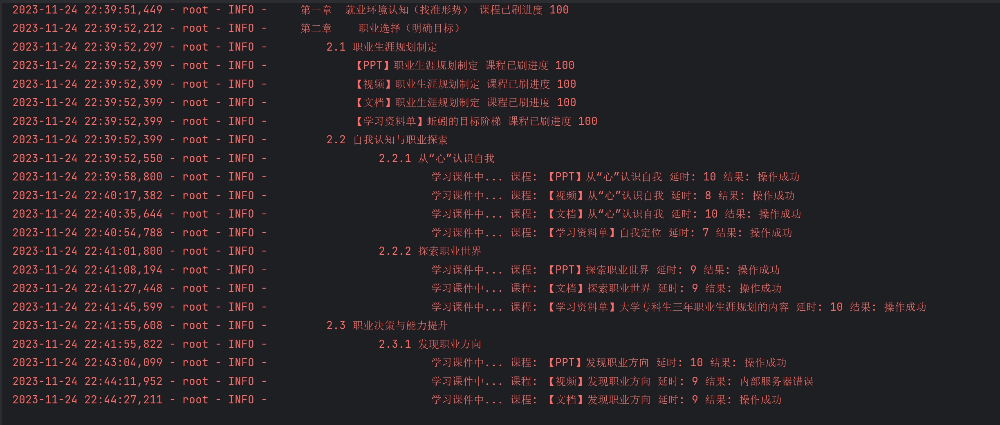

# zjy-work-answer

🥇+🎉免费🎉，智慧职教 职教云 mooc 慕课 MOOC学院 ⛔答题 ⛔考试 ⛔测验 ✅刷课⛔ zjy2.icve.com.cn 自动刷课  稳定，免费工具，简单上手🎁

- **职教云 【刷课】挂机版**

- **仅适用于: <https://zjy2.icve.com.cn>**

- **智慧职教 mooc 请前往 [mooc-work-answer >>>](https://github.com/11273/mooc-work-answer)**

  ***

## 🎄 公告 🎄

**重要声明：该项目仅供用于学习目的，鼓励学生更高效地管理和完成在线课程，严禁将其用于盈利目的。**
>
> - 🎉
> - 📢 当前处于Bate测试阶段，请按需使用

## 运行环境

- python ≥ 3.6
- 运行所需 pip 包请自行切换到本项目根目录使用以下命令进行安装

  ```pip
   pip install -i https://pypi.tuna.tsinghua.edu.cn/simple -r requirements.txt
  ```

## 使用方法

1. 打开文件`StartWork.py`输入账号密码

    ```python
    username = ""  # 账号
    password = ""  # 密码
    ```

2. 运行 `StartWork.py`

## BUG 提交

- 请详细提供 **错误信息** 以及错误出现的 **代码行**
- 提交请前往: [点击前往 >>>](https://github.com/11273/zjy-work-answer/issues/new)

## 免责声明

⚠️ 本项目仅限于学习交流使用，项目中使用的代码及功能如有侵权或违规请联系作者删除

⚠️ 本项目接口数据均来自于 zjy，请勿用于其它商业目的

⚠️ 如使用本项目代码造成侵权与作者无关

[](https://github.com/11273/zjy-work-answer)

## 效果展示 (随着版本迭代，实际输出内容可能有所不同，请以最新版本为准)


